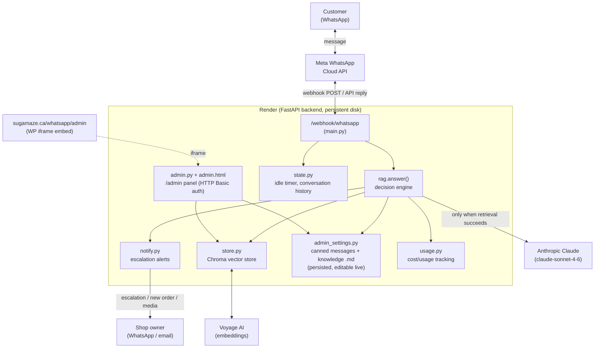

# GroundedBot — Sugamaze WhatsApp Assistant

A tenant-aware, **grounded** Q&A chatbot for local businesses, currently deployed
as the WhatsApp assistant for **Sugamaze**, a cake shop in Whitby, Ontario. It
answers strictly from sources you ingest (website pages, a reviewed FAQ, and
admin-editable canned messages) and refuses — instead of guessing — when the
answer isn't in those sources. That refusal behavior is the whole point: a
bakery bot that invents an allergen or a price is a liability, not a feature.

The core retrieval/grounding engine is business-agnostic (multi-tenant from
day one), but the deployed system prompt, shortcuts, and knowledge base are
currently specific to Sugamaze.

---

## Architecture



### Request flow (a single incoming WhatsApp message)

1. Meta POSTs the message to `POST /webhook/whatsapp`.
2. `state.touch()` resets that customer's idle timer.
3. `rag.answer()` runs the decision logic below — deterministic shortcuts
   first, then retrieval + guardrail, then (only if grounded) a call to
   Claude with the retrieved context and recent conversation history.
4. The reply is sent back via `whatsapp.send_message()`.
5. The turn is appended to that customer's short conversation history
   (`state.append_turn`), and Claude call token usage is recorded
   (`usage.record_claude_call`) if the RAG path was used.

A background loop (`_idle_checkin_loop`) separately nudges customers who've
gone quiet for `IDLE_CHECKIN_SECONDS` (default 60s) with a "still there?"
Yes/No prompt, and ends tracking if they say no.

---

## When does the bot answer, ask for clarification, abstain, or escalate?

This is the most important part of the system to understand — it's what
makes the bot trustworthy enough for a real business to put in front of
real customers. The logic lives in `backend/app/rag.py`, checked **in this
exact order** for every message:

### 1. Deterministic shortcuts (no Claude call, no retrieval, always exact)

These bypass the AI entirely — they're used for content that's too
important to leave to retrieval/generation variance:

| Trigger | Response |
|---|---|
| Greeting ("hi", "hello", "hey") | Welcome + interactive menu (WhatsApp list message) |
| "Thanks", "bye", "goodbye" | Fixed closing line, ends conversation tracking |
| Order intent ("I want to place an order", "how do I order", etc.) | Fixed order-collection message + **escalates immediately** to the shop as a "NEW CUSTOM ORDER" alert |
| Allergy/dietary keywords (vegan, gluten, dairy, nuts, lactose, etc.) | Fixed safety escalation message with phone/email + **escalates immediately** to the shop |
| Location keywords/phrases | Fixed exact address |
| Hours keywords | Fixed exact store hours |
| Menu keywords | Fixed complete menu (not retrieval — see *Limitations*) |
| Flavour keywords | Fixed complete flavour list (not retrieval — see *Limitations*) |

All of these texts (except the hardcoded keyword lists themselves) are
editable live via the **admin panel** (`/admin`) — changes take effect
immediately, no redeploy or restart needed.

### 2. Retrieval + guardrail (everything else)

For any message that doesn't match a shortcut:

1. **Retrieve** the top `TOP_K` (default 5) chunks from the vector store
   (Voyage AI embeddings, Chroma, cosine similarity).
2. **Guardrail — abstain without calling Claude if nothing is relevant
   enough.** Any chunk with cosine distance above `MAX_DISTANCE` (default
   0.75) is dropped. If *no* chunk survives, the bot immediately returns the
   fixed escalation message and notifies the shop — **Claude is never
   called in this case**, which guarantees no hallucinated answer is even
   possible here, and saves cost.
3. If at least one chunk survives, it's passed to Claude as `<context>`
   along with the last ~3 exchanges of conversation history (for resolving
   references like "that one" — **never** as a source of facts, per the
   system prompt) and a strict system prompt.

### 3. Inside the Claude call: answer, clarify, or escalate

The system prompt (`SYSTEM_PROMPT` in `rag.py`) gives Claude exactly three
allowed outcomes, and instructs it never to blur them:

- **Answer directly** — only when `<context>` clearly and specifically
  covers what was asked. Must reproduce an exact FAQ Q&A match faithfully
  (no paraphrasing), never truncate a phone/address/price mid-string, and
  never extrapolate from a *similar-but-different* item's context (e.g.
  answering a wedding-cake price question using birthday-cake context is
  explicitly forbidden — that's treated as a hallucination risk, not a
  valid answer).

- **Ask ONE clarifying question** — only when the *ambiguity is in the
  customer's wording*, not the knowledge base (e.g. "how much does a cake
  cost?" with no size/type given, where the context has multiple relevant
  answers depending on which they mean). One short question, never a list,
  and only if the answer would genuinely change.

- **Escalate (abstain)** — whenever the *information itself* is missing,
  incomplete, or doesn't clearly cover the question. This is not a wording
  problem, so no clarifying question is asked — the bot returns the exact
  fixed escalation string and notifies the shop via `notify.notify_escalation()`.
  A confident-sounding guess is explicitly called out in the system prompt
  as the single worst failure mode for this bot.

### Escalation channels (what "notify the shop" actually does)

- `notify.notify_escalation()` — general "bot couldn't answer" or allergy
  question. Tries an approved WhatsApp message template first (works
  outside the 24-hour customer-service window), falls back to free-form
  text (works only within 24h), and separately emails `ESCALATION_EMAIL` if
  SMTP is configured.
- `notify.notify_new_order()` — distinct, clearly-labeled "🎂 NEW CUSTOM
  ORDER" alert, so a sales lead is never confused with a bot failure.
- `notify.notify_order_media()` — forwards a customer's uploaded design
  photo/file directly to the shop's WhatsApp by re-sending the Meta media
  ID (no download/re-upload needed).

---

## What's inside

```
groundedbot/
├── backend/
│   ├── app/
│   │   ├── main.py           # FastAPI routes + WhatsApp webhook handling
│   │   ├── rag.py            # THE decision engine — see above
│   │   ├── ingest.py         # URL / PDF / text / FAQ -> chunks
│   │   ├── store.py          # tenant-aware Chroma vector store
│   │   ├── autoseed.py       # rebuilds the vector store fresh on every startup
│   │   ├── admin.py          # admin panel API (HTTP Basic auth)
│   │   ├── admin_settings.py # persisted canned messages + knowledge .md files
│   │   ├── usage.py          # Claude/Voyage call tracking + cost estimate
│   │   ├── state.py          # per-customer idle timer + short conversation history
│   │   ├── notify.py         # escalation alerts (WhatsApp template + email)
│   │   ├── whatsapp.py       # Meta Cloud API glue (send/receive/media/templates)
│   │   ├── config.py         # settings from env
│   │   └── schemas.py
│   ├── static/admin.html     # admin panel single-page UI
│   ├── knowledge/            # shipped defaults (sugamaze.md, faq.md)
│   ├── eval/                 # Claude-as-judge hallucination eval harness
│   ├── requirements.txt
│   └── .env.example
├── wordpress-plugin/
│   └── sugamaze-admin-embed/ # WP plugin: sugamaze.ca/whatsapp/admin -> iframe
└── web/
    └── widget.html           # minimal generic tester widget
```

## Run it in ~5 minutes

```bash
cd backend
python -m venv .venv && source .venv/bin/activate     # Windows: .venv\Scripts\activate
pip install -r requirements.txt

cp .env.example .env
# fill in ANTHROPIC_API_KEY, VOYAGE_API_KEY, WhatsApp credentials, ADMIN_USERNAME/PASSWORD

uvicorn app.main:app --reload --port 8000
```

Visit `/admin` for the admin panel, or `/health` to confirm the server is up.
Knowledge base auto-rebuilds from `backend/knowledge/*.md` and the configured
website URLs on every startup (`autoseed.py`) — takes several minutes under
Voyage's free-tier rate limit.

## How to tune

- `MAX_DISTANCE`: lower = stricter grounding (refuses more, hallucinates
  less). This is the single most important grounding lever.
- `TOP_K`: how many chunks to retrieve.
- `CHUNK_SIZE` / `CHUNK_OVERLAP`: sliding-window chunking for prose content
  (website pages, `sugamaze.md`). The FAQ (`faq.md`) uses a different
  strategy — one chunk per Q&A pair (`ingest_faq_md`), not the sliding
  window, so retrieval never returns a blob of several unrelated answers.
- `CLAUDE_MODEL`: Sonnet for quality; Haiku for cheaper/faster.
- `IDLE_CHECKIN_SECONDS`: how long before nudging a quiet customer.
- Everything under **Store Messages** and **Knowledge Base** in `/admin` —
  no redeploy needed for content changes.

---

## Limitations (current, honest)

- **In-memory, single-instance state.** `state.py` (idle timers, conversation
  history) lives in process memory — it resets on every Render restart, and
  would need Redis or similar to run more than one instance.
- **Keyword-based intent detection for shortcuts.** Menu, hours, location,
  order-intent, and allergy detection are all substring/keyword matching,
  not NLU — phrasing outside the anticipated keyword lists falls through to
  the general RAG path (which is a safe fallback, just not as fast/precise).
- **Menu and flavours bypass retrieval entirely.** This was a deliberate
  fix (retrieval over 20+ pages couldn't guarantee a *complete* menu every
  time), but it means these two answers only update via the admin panel,
  not by re-ingesting the website.
- **Fixed-size chunking, not semantic.** The sliding-window chunker doesn't
  understand sentence/paragraph boundaries — fine at this corpus size
  (~150 chunks), but wouldn't scale gracefully to a much larger knowledge base.
- **Conversation history is short and non-persistent.** ~3 exchanges, reset
  on restart, only used for reference resolution — the bot has no long-term
  memory of a customer across sessions.
- **Cost dashboard is an estimate, not a bill.** `usage.py` uses rough
  per-token pricing constants that can drift from Anthropic/Voyage's actual
  current pricing — always cross-check their consoles for real billing.
- **Single static admin login.** HTTP Basic Auth, one username/password, no
  per-user roles or audit log of who changed what.
- **CORS is wide open** (`allow_origins=["*"]`) and the ingest endpoints
  (`/ingest/*`) have no auth — anyone who finds the URL can currently push
  content into the knowledge base. Should be locked down before wider exposure.
- **`/debug/config` is public** — exposes non-secret operational info
  (escalation number, token-presence booleans, recent status callbacks).
  Should be removed or gated behind admin auth.
- **WhatsApp production messaging tier depends on Meta's own review
  process** (Business Verification, message template approval) — outside
  this codebase's control, and can gate real-world message volume/reliability.
- **No automated test suite beyond the eval harness** (`backend/eval/`,
  Claude-as-judge grading against known-correct facts) — no unit/integration
  tests, no CI pipeline.

## Future scope

**Near-term, natural extensions of what exists:**
- Redis-backed (or otherwise persistent) state for multi-instance
  deployment and conversation history that survives restarts.
- Admin-panel editing for the website URL list autoseed pulls from, and
  for `MAX_DISTANCE`/`TOP_K` (currently env-var only).
- Automated CI running the eval harness on every push, to catch
  hallucination regressions before they reach production.
- Role-based admin accounts with an audit log, replacing the single static login.
- Lock down CORS to the actual client domain(s) and add per-tenant auth to
  `/ingest/*`; remove or gate `/debug/config`.

**Phase 2 (larger, not built yet):**
1. **Tool use** — give Claude tools (`check_availability`, `book_slot`,
   `capture_order`, `send_summary`) so it can *act*, not just answer.
2. **Human-in-the-loop** — the bot drafts/queues the booking or order; the
   owner approves. (Owners want reliable, not autonomous.)
3. **Order summary + confirmation** back to the customer once the shop
   confirms pricing/availability.
4. **Follow-up + feedback** — scheduled nudges, post-visit feedback capture.

n8n (or similar) is the natural place for the scheduled/queued plumbing in
Phase 2 steps 2–4; this RAG service stays the brain — the retrieve →
guardrail → ground → escalate/clarify pattern documented above doesn't change,
new capability layers on top of it.

---

## Multi-tenancy note

The vector store (`store.py`) is tenant-aware from day one (one Chroma
collection per `tenant_id`) even though the current deployment only serves
one tenant (`sugamaze`). Reusing this codebase for another business means
swapping the knowledge base, system prompt, and shortcut keywords in
`rag.py` — the retrieval/guardrail/escalation architecture itself doesn't
need to change per client.
